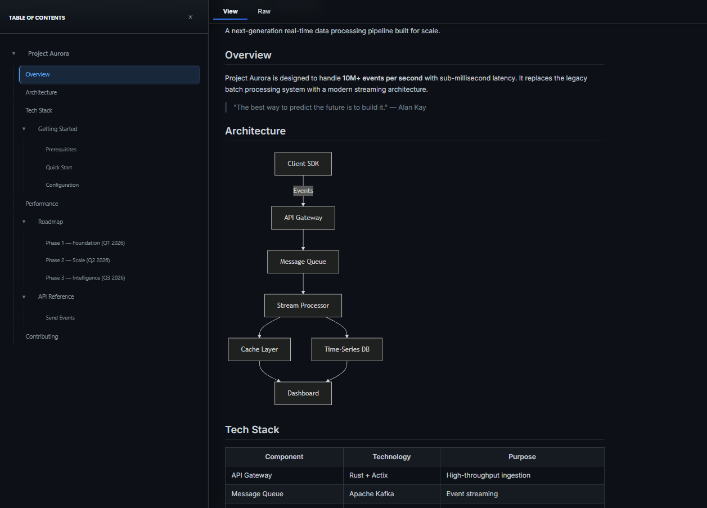

# Markdown Viewer - Simple & Secure

[](https://github.com/ba0918/markdown-viewer/actions/workflows/ci.yml)
[](https://github.com/ba0918/markdown-viewer/actions/workflows/release.yml)

**[日本語版 README はこちら / Japanese](README_ja.md)**

Simple and secure local Markdown viewer for Chrome.

## Why?

Built to avoid extension malware risks with minimal permissions.

## Features

- 🔒 **Minimal permissions** - Only what's needed (file access only by default)
- 🔥 **Hot Reload** - Auto-detect file changes
- 🎨 **6 themes** - Light/Dark/GitHub/Minimal/SolarizedLight/SolarizedDark
- 🌐 **Remote URL Support (Optional)** - Add custom domains for remote Markdown
  files
- **GFM support** - Syntax highlight, Mermaid, Math, ToC
- **View Raw toggle** - Switch between rendered and raw Markdown
- **Frontmatter support** - YAML frontmatter parsing

## Screenshots



## Install

### From Chrome Web Store

[Install from Chrome Web Store](https://chromewebstore.google.com/detail/markdown-viewer-simple-se/meacjeaboaldhcicilhghkcgmpljbeog)

### Manual Install

```bash
git clone https://github.com/ba0918/markdown-viewer.git
cd markdown-viewer
deno task build  # Requires Deno 2.x
```

1. Open `chrome://extensions/` → Enable Developer mode
2. Click "Load unpacked"
3. Extension details → Enable "Allow access to file URLs"

## Usage

1. Open `.md` file in Chrome
2. Done

## Security

### What it does

- ✅ Read local Markdown files
- ✅ Store settings locally
- ✅ Access remote URLs (only domains you explicitly authorize)

### What it doesn't

- ❌ Data collection/tracking
- ❌ Network requests to unauthorized domains
- ❌ Access any website without your permission

**Permissions:**

- Required: `storage`, `activeTab`, `scripting`, `file:///*`
- Optional: `https://*/*` (only when you add custom domains in Settings)

## FAQ

### WSL2 files?

Rendering works fine. Hot Reload doesn't work due to Chrome extension
restrictions.

## License

[MIT License](LICENSE)
