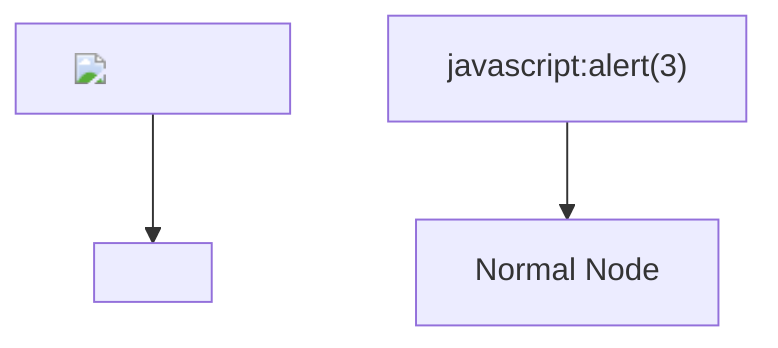

# 包括的品質改善 - Comprehensive Quality Improvement

**Cycle ID:** `20260217040010` **Started:** 2026-02-17 04:00:10 **Status:** 🔵
Implementing

---

## 📝 What & Why

全体レビュー（セキュリティ・パフォーマンス・メモリ効率・コード品質・テスト）で発見された改善点を体系的に修正し、「必要最低限・シンプル・高品質」のMarkdown
Viewerとしての完成度を引き上げる。

## 🎯 Goals

- セキュリティの盲点をゼロにする
- メモリ効率・パフォーマンスの潜在的問題を解消する
- テストカバレッジの可視化と強化
- コードの一貫性・保守性を向上させる
- Chrome Web Store公開に向けた最終品質を達成する

---

## 📋 改善一覧（優先度順）

### Phase 1: セキュリティ修正 (Critical)

| #   | タスク                                   | 影響ファイル                                   | 重要度    |
| --- | ---------------------------------------- | ---------------------------------------------- | --------- |
| 1-1 | エラー表示HTMLのXSSエスケープ            | `src/content/index.ts`, `src/shared/utils/`    | 🔴 High   |
| 1-2 | Export UTF-8変換のスタック溢れリスク修正 | `src/services/export-service.ts`               | 🟡 Medium |
| 1-3 | Mermaid SVG XSS E2Eテスト追加            | `tests/e2e/xss.spec.ts`, `tests/e2e/fixtures/` | 🔴 High   |

#### 1-1: エラー表示HTMLのXSSエスケープ

**問題:** `renderMarkdown()` のcatch節で `error.message`
を未エスケープのままHTMLに埋め込んでいる。

```typescript
// ❌ 現状 (content/index.ts:297-302)
document.body.innerHTML = `
  <div style="...">
    <p>${error instanceof Error ? error.message : "Unknown error"}</p>
  </div>
`;
```

**修正方針:**

- `escapeHtml()` 関数を `shared/utils/` に追加（domain/export/html-exporter.ts
  から移動・共通化）
- **null/undefined入力に対するガードを含める**（空文字列を返す）
- エラー表示でエスケープを適用
- **MarkdownViewer.tsx:195の手動エスケープ `code.replace(/</g, "&lt;")` も
  `escapeHtml()` に統一する**

```typescript
// ✅ escapeHtml() の実装（null/undefinedガード付き）
export function escapeHtml(str: string | null | undefined): string {
  if (str == null) return "";
  return str
    .replace(/&/g, "&amp;")
    .replace(/</g, "&lt;")
    .replace(/>/g, "&gt;")
    .replace(/"/g, "&quot;")
    .replace(/'/g, "&#039;");
}
```

```typescript
// ✅ 修正後 (content/index.ts)
import { escapeHtml } from "../shared/utils/escape-html.ts";

document.body.innerHTML = `
  <div style="...">
    <p>${
  escapeHtml(error instanceof Error ? error.message : "Unknown error")
}</p>
  </div>
`;
```

**Files to Change:**

```
src/shared/utils/escape-html.ts            - 新規: escapeHtml()を共通化（null/undefinedガード付き）
src/shared/utils/escape-html.test.ts       - 新規: テスト（null, undefined, 空文字列, 特殊文字, 複合ケース）
src/domain/export/html-exporter.ts         - escapeHtmlをshared/からimportに変更
src/content/index.ts                       - エラー表示でescapeHtml()使用
src/content/components/MarkdownViewer.tsx   - line 195の手動replace → escapeHtml()に統一
```

#### 1-2: Export UTF-8変換のスタック溢れリスク修正

**問題:** `background-handler.ts`
のEXPORT_AND_DOWNLOAD処理で、UTF-8バイト配列をforループで1バイトずつ文字列結合している。大きなファイルでスタック溢れやパフォーマンス劣化のリスク。

**⚠️ アーキテクチャ修正（レビュー指摘）:**
現在のデータ変換ロジック（TextEncoder→btoa→dataUrl）はビジネスロジックであり、messaging層（background-handler.ts）に存在するのはレイヤー違反。`exportService`
または `domain/export/` に移動する。

```typescript
// ❌ 現状 (background-handler.ts:141-146) - messaging層にビジネスロジック
const utf8Bytes = new TextEncoder().encode(html);
let binary = "";
for (let i = 0; i < utf8Bytes.length; i++) {
  binary += String.fromCharCode(utf8Bytes[i]);
}
const dataUrl = "data:text/html;base64," + btoa(binary);
```

**修正方針:**

- **データ変換ロジックを `src/domain/export/` に移動**（レイヤー遵守）
- チャンク分割 + **Array.join()** で O(n) 文字列結合（`binary +=` は O(n^2)
  のため不使用）
- background-handler.tsはservice/domain呼び出しのみ

```typescript
// ✅ 修正後: src/domain/export/base64-encoder.ts（新規）
export function encodeHtmlToDataUrl(html: string): string {
  const utf8Bytes = new TextEncoder().encode(html);
  const CHUNK_SIZE = 8192;
  const chunks: string[] = [];
  for (let i = 0; i < utf8Bytes.length; i += CHUNK_SIZE) {
    const chunk = utf8Bytes.subarray(i, i + CHUNK_SIZE);
    chunks.push(String.fromCharCode(...chunk));
  }
  const binary = chunks.join(""); // O(n) - Array.join()を使用
  return "data:text/html;base64," + btoa(binary);
}
```

```typescript
// ✅ background-handler.ts - service/domain呼び出しのみ
import { encodeHtmlToDataUrl } from "../../domain/export/base64-encoder.ts";
// ... handler内
const dataUrl = encodeHtmlToDataUrl(html);
```

**Files to Change:**

```
src/domain/export/base64-encoder.ts          - 新規: encodeHtmlToDataUrl()
src/domain/export/base64-encoder.test.ts     - 新規: テスト（空文字列、大容量、マルチバイト文字）
src/messaging/handlers/background-handler.ts - データ変換ロジックを削除、domain呼び出しに変更
```

#### 1-3: Mermaid SVG XSS E2Eテスト追加（レビュー指摘による新規タスク）

**問題:** MarkdownViewer.tsx内のMermaidレンダリングでSVGを `innerHTML`
で挿入している（line 188, 237）。Mermaid自体は `securityLevel: 'strict'`
で保護されているが、**E2Eレベルでの検証テストが存在しない**。

**修正方針:**

- 既存のXSS E2Eテスト（`tests/e2e/xss.spec.ts`）にMermaid
  SVGインジェクションのテストケースを追加
- Mermaidの `securityLevel: 'strict'` が有効に機能していることを検証
- 悪意あるMermaidコード（`<script>` タグ注入、`onload`
  イベント等）を含むフィクスチャMDファイルを作成

````markdown
<!-- tests/e2e/fixtures/xss-mermaid.md -->

# Mermaid XSS Test


````

```
**Files to Change:**
```

tests/e2e/fixtures/xss-mermaid.md - 新規: Mermaid XSSテスト用フィクスチャ
tests/e2e/xss.spec.ts - Mermaid SVGインジェクションテスト追加

````
---

### Phase 2: パフォーマンス改善 (High)

| #   | タスク                             | 影響ファイル                                        | 重要度    |
| --- | ---------------------------------- | --------------------------------------------------- | --------- |
| 2-1 | Hot Reloadをハッシュ比較方式に変更 | `shared/utils/`, `content/index.ts`                 | 🟡 Medium |
| 2-2 | Hot Reloadをローカル専用に制限     | `content/index.ts`, `HotReloadSettings.tsx`         | 🟡 Medium |

> **Note（レビュー指摘）:** 旧2-2「ToCポーリング→MutationObserver」は費用対効果が低いため削除。現行の50msポーリング×最大40回は十分軽量であり、MutationObserverへの変更による複雑化のリスクが効果を上回る。

#### 2-1: Hot Reloadをハッシュ比較方式に変更

**問題:** 現状はファイル全体を文字列としてfetch →
前回の文字列と比較。大きなMDファイル（数MB）でメモリを無駄に消費する。

> **Note（レビュー指摘）:** ネットワーク帯域はfetch自体が全文取得するため変わらない。改善はcontent側のメモリ保持量の削減が主な効果。

**⚠️ アーキテクチャ修正（レビュー指摘）:** ハッシュ計算はビジネスロジックなので messaging層（background-handler.ts）に直接書かない。`shared/utils/hash.ts` にユーティリティ関数として切り出す。

**⚠️ 実装順序（レビュー指摘）:** Phase 3-2（グローバル変数整理）は本タスクの `lastFileContent → lastFileHash` 変更に依存するため、**必ず本タスク完了後に着手すること**。

**修正方針:**

- `shared/utils/hash.ts` にSHA-256ハッシュ計算関数を作成
- background-handler.tsはユーティリティ関数を呼び出すのみ
- content側ではハッシュのみ保持（数十バイト）
- ファイル全体の文字列保持を廃止
- **crypto.subtle.digest のフォールバック戦略:** Service Worker環境では常にSecureContextなので利用可能。file://プロトコルのContent Script側では使用しないため問題なし。ただし万が一の失敗時はfull-text比較にフォールバックする。

```typescript
// ✅ shared/utils/hash.ts（新規）
export async function computeSHA256(content: string): Promise<string> {
  const encoder = new TextEncoder();
  const data = encoder.encode(content);
  const hashBuffer = await crypto.subtle.digest("SHA-256", data);
  const hashArray = Array.from(new Uint8Array(hashBuffer));
  return hashArray.map((b) => b.toString(16).padStart(2, "0")).join("");
}
````

```typescript
// ✅ background-handler.ts - ユーティリティ呼び出しのみ
import { computeSHA256 } from "../../shared/utils/hash.ts";

case "CHECK_FILE_CHANGE": {
  const response = await fetch(url);
  const content = await response.text();
  try {
    const hash = await computeSHA256(content);
    return { success: true, data: hash };
  } catch {
    // フォールバック: ハッシュ計算失敗時はコンテンツ全体を返す
    return { success: true, data: content };
  }
}
```

```typescript
// content/index.ts - lastFileContent → lastFileHash に変更
let lastFileHash: string | null = null;
```

**Files to Change:**

```
src/shared/utils/hash.ts                     - 新規: computeSHA256()
src/shared/utils/hash.test.ts                - 新規: テスト
src/messaging/handlers/background-handler.ts - ユーティリティ呼び出しに変更
src/content/index.ts                         - lastFileContent → lastFileHash
src/shared/types/message.ts                  - 型変更（必要に応じて）
```

#### 2-2: Hot Reloadをローカル専用に制限

**問題:** 現状のHot Reloadは `location.href`
をそのままfetchしているため、リモートURL（`https://example.com/doc.md`
等）でも2秒間隔でポーリングが走る。外部サーバーへの不必要な負荷となり迷惑行為になりうる。

**修正方針:**

- `startHotReload()` の冒頭で**URLプロトコルチェック**を追加
- 許可するURL: `file://`、`http://localhost`、`http://127.0.0.1`、`http://[::1]`
- それ以外のURLではHot Reloadを開始せず、loggerで理由を通知
- Settings画面のHot
  Reload設定欄に**「ローカルファイル/localhostのみ対応」の注意書き**を表示

```typescript
// ✅ content/index.ts - URLプロトコルチェック追加
const isLocalUrl = (url: string): boolean => {
  try {
    const parsed = new URL(url);
    if (parsed.protocol === "file:") return true;
    if (parsed.protocol === "http:" || parsed.protocol === "https:") {
      const hostname = parsed.hostname;
      return hostname === "localhost" ||
        hostname === "127.0.0.1" ||
        hostname === "[::1]" ||
        hostname === "::1";
    }
    return false;
  } catch {
    return false;
  }
};

const startHotReload = async (interval: number): Promise<void> => {
  // ローカルファイル/localhost以外はHot Reload非対応
  if (!isLocalUrl(location.href)) {
    logger.log(
      "Hot Reload is only available for local files (file://) and localhost. " +
        "Remote URLs are not supported to avoid unnecessary server load.",
    );
    return;
  }
  // ... 既存処理
};
```

```tsx
// ✅ HotReloadSettings.tsx - 注意書き追加
<p class="hot-reload-note">
  ※ Hot Reloadはローカルファイル（file://）およびlocalhost環境でのみ動作します。
</p>;
```

**Files to Change:**

```
src/content/index.ts                                   - isLocalUrl()ガード追加
src/settings/options/components/HotReloadSettings.tsx   - 注意書きUI追加
src/settings/options/options.css                        - 注意書きスタイル（必要に応じて）
```

---

### Phase 3: コード品質改善 (Medium)

| #   | タスク                                          | 影響ファイル         | 重要度    |
| --- | ----------------------------------------------- | -------------------- | --------- |
| 3-1 | MarkdownViewer巨大useEffectのカスタムフック分割 | `MarkdownViewer.tsx` | 🟡 Medium |
| 3-2 | content/index.tsのグローバル変数整理            | `content/index.ts`   | 🟢 Low    |
| 3-3 | Markdown拡張子検出の統一                        | `content/index.ts`   | 🟢 Low    |

#### 3-1: MarkdownViewer巨大useEffectのカスタムフック分割

**問題:** 1つのuseEffectに「コピーボタン追加 + MathJax +
Mermaid」が全部入っている（~150行）。テスタビリティ・可読性が低い。

**修正方針:**

- `useCopyButtons(containerRef, viewMode)` - コピーボタン追加ロジック
- `useMathJax(containerRef, html, viewMode)` - MathJax レンダリング
- `useMermaid(containerRef, html, themeId, viewMode)` - Mermaid レンダリング

**⚠️ ディレクトリ修正（レビュー指摘）:** `src/content/hooks/`
は存在しない。以下のいずれかで配置する:

- **案A:** `src/content/components/hooks/` （MarkdownViewerに近い場所）
- **案B:** `src/ui-components/markdown/hooks/`
  （ui-components配下で再利用性重視）

→
MarkdownViewer.tsx専用のフックであり他コンポーネントからの再利用は想定しないため、**案A:
`src/content/components/hooks/`** を採用する。

```
src/content/components/hooks/
  useCopyButtons.ts    - 新規
  useMathJax.ts        - 新規
  useMermaid.ts        - 新規
src/content/components/MarkdownViewer.tsx - フックを使用するよう書き換え
```

**⚠️ ADR-007例外適用（レビュー指摘）:**
これらのフックはDOM操作系domain（renderMath,
renderMermaid）を直接呼び出す。これはADR-007の例外「DOM操作系domainのcontent直接呼び出し」に該当するため、レイヤー違反ではない。

**注意点:**

- `isMounted` フラグは各フックで独立管理
- 依存配列の設計:
  - `useCopyButtons`: `[viewMode]`
    （htmlは不要、containerRef.currentの変化で対応）
  - `useMathJax`: `[html, viewMode]`
  - `useMermaid`: `[html, themeId, viewMode]`
- 既存のE2Eテストがそのまま通ることを確認

#### 3-2: content/index.tsのグローバル変数整理

**⚠️ 実装順序（レビュー指摘）:** Phase 2-1（Hot
Reloadハッシュ比較）完了後に着手すること。`lastFileContent → lastFileHash`
の変更を本タスクの `contentState` に反映するため。

**問題:** `currentMarkdown`, `hotReloadInterval`, `lastFileContent`,
`relativeLinkHandlerSetup`, `storageListenerSetup` の5つのグローバル変数。

**修正方針:**

- モジュールスコープのオブジェクトに集約（Content Scriptの制約上、クラスは不要）

```typescript
const contentState = {
  currentMarkdown: "",
  hotReloadInterval: null as ReturnType<typeof globalThis.setInterval> | null,
  lastFileHash: null as string | null, // Phase 2-1のハッシュ化と同時対応
  relativeLinkHandlerSetup: false,
  storageListenerSetup: false,
};
```

**Files to Change:**

```
src/content/index.ts - グローバル変数をcontentStateオブジェクトに集約
```

#### 3-3: Markdown拡張子検出の統一

**問題:** `isMarkdownFile()` は `.md`/`.markdown` のみ検出。docs/SECURITY.mdの
`isValidFilePath()` は `.mdown`/`.mkd` も対応。manifest.jsonのcontent_scriptsも
`.md`/`.markdown` のみ。

**修正方針:**

- `shared/constants/` にMarkdown拡張子リストを定義
- `isMarkdownFile()` と `isValidFilePath()` の両方で参照

```typescript
// shared/constants/markdown.ts
export const MARKDOWN_EXTENSIONS = [
  ".md",
  ".markdown",
  ".mdown",
  ".mkd",
] as const;
```

**Files to Change:**

```
src/shared/constants/markdown.ts            - 新規: 拡張子定義
src/content/index.ts                        - MARKDOWN_EXTENSIONS参照
manifest.json                               - content_scripts.matchesに追加
```

**注意:** manifest.jsonのmatchesにワイルドカードで `.mdown`/`.mkd`
を追加すると対象ページが増える。これはユーザー承認が必要なので、対応するかオタクくんに確認する。

---

### Phase 4: テスト強化 (Medium)

| #   | タスク                     | 影響ファイル      | 重要度    |
| --- | -------------------------- | ----------------- | --------- |
| 4-1 | テストカバレッジ計測の追加 | `deno.json`       | 🟡 Medium |
| 4-2 | エッジケーステスト追加     | 各domain/services | 🟢 Low    |

#### 4-1: テストカバレッジ計測の追加

**修正方針:**

- `deno.json` に `test:coverage` タスクを追加
- `deno test --coverage=coverage/ --allow-all && deno coverage coverage/`
- CI/CDにも統合可能

```json
{
  "tasks": {
    "test:coverage": "deno test --coverage=coverage/ --allow-all && deno coverage coverage/"
  }
}
```

**Files to Change:**

```
deno.json - test:coverageタスク追加
.gitignore - coverage/ ディレクトリ除外
```

#### 4-2: エッジケーステスト追加

**追加するテスト:**

- 空文字列Markdown → 空のHTMLが返る
- 超長文Markdown（10MB相当） → OOMしない
- 不正なFrontmatter（バイナリデータ）→ graceful fallback
- content/index.tsの `isMarkdownFile()` 各パターン
- sanitizerに対する最新XSSベクター追加

**Files to Change:**

```
src/domain/markdown/parser.test.ts       - 空文字列、超長文テスト
src/domain/markdown/sanitizer.test.ts    - 追加XSSベクター
src/domain/frontmatter/parser.test.ts    - バイナリデータテスト
src/services/markdown-service.test.ts    - エッジケーステスト
```

---

### Phase 5: ドキュメント・仕上げ (Low)

| #   | タスク                          | 影響ファイル                                                               | 重要度 |
| --- | ------------------------------- | -------------------------------------------------------------------------- | ------ |
| 5-1 | JSDoc改善（前回サイクルの続き） | 各ファイル                                                                 | 🟢 Low |
| 5-2 | ドキュメント更新                | `.claude/CLAUDE.md`, `docs/DIRECTORY_STRUCTURE.md`, `docs/ARCHITECTURE.md` | 🟢 Low |

#### 5-1: JSDoc改善

前サイクル（20260217020128）で計画済み。「設計メモ」から「機能説明」への改善を完了させる。

#### 5-2: ドキュメント更新

**⚠️ 拡大（レビュー指摘）:**
CLAUDE.mdだけでなく、以下のドキュメントも更新が必要:

改善後のアーキテクチャを反映:

- **`.claude/CLAUDE.md`**:
  - `test:coverage` タスクの追加
  - `shared/constants/markdown.ts` の追加
  - カスタムフック分割後の構造
- **`docs/DIRECTORY_STRUCTURE.md`**:
  - `src/content/components/hooks/` ディレクトリの追加
  - `src/shared/utils/hash.ts` の追加
  - `src/shared/utils/escape-html.ts` の追加
  - `src/domain/export/base64-encoder.ts` の追加
  - `src/shared/constants/markdown.ts` の追加
- **`docs/ARCHITECTURE.md`**:
  - カスタムフック分割パターンの説明追加
  - ADR-007例外適用ケースの更新

---

## 📊 全体進行表

| Phase                       | タスク                                 | Status | 依存関係                |
| --------------------------- | -------------------------------------- | ------ | ----------------------- |
| **Phase 1: セキュリティ**   |                                        |        |                         |
| 1-1                         | エラー表示XSSエスケープ                | ⚪     |                         |
| 1-2                         | Export UTF-8チャンク分割（domain移動） | ⚪     |                         |
| 1-3                         | Mermaid SVG XSS E2Eテスト              | ⚪     |                         |
| **Phase 2: パフォーマンス** |                                        |        |                         |
| 2-1                         | Hot Reloadハッシュ比較（shared移動）   | ⚪     |                         |
| 2-2                         | Hot Reloadローカル専用制限             | ⚪     |                         |
| **Phase 3: コード品質**     |                                        |        |                         |
| 3-1                         | MarkdownViewer useEffect分割           | ⚪     |                         |
| 3-2                         | content/index.tsグローバル変数整理     | ⚪     | **2-1完了後に着手**     |
| 3-3                         | Markdown拡張子検出統一                 | ⚪     |                         |
| **Phase 4: テスト強化**     |                                        |        |                         |
| 4-1                         | カバレッジ計測追加                     | ⚪     |                         |
| 4-2                         | エッジケーステスト追加                 | ⚪     |                         |
| **Phase 5: ドキュメント**   |                                        |        |                         |
| 5-1                         | JSDoc改善                              | ⚪     |                         |
| 5-2                         | ドキュメント更新                       | ⚪     | **全Phase完了後に着手** |

**Legend:** ⚪ Pending · 🟡 In Progress · 🟢 Done

---

## 🔒 Security Checklist

- [ ] `escapeHtml()` が全てのユーザー入力表示箇所で使用されている
- [ ] `escapeHtml()` がnull/undefined入力を安全に処理する
- [ ] MarkdownViewer.tsxの手動エスケープが `escapeHtml()` に統一されている
- [ ] Export処理でスタック溢れが発生しない（チャンク分割確認）
- [ ] Export処理のデータ変換がdomain層に移動されている（レイヤー遵守）
- [ ] Hot Reloadでファイル全体を保持していない（ハッシュのみ）
- [ ] ハッシュ計算がshared/utils/に配置されている（レイヤー遵守）
- [ ] crypto.subtle.digest失敗時のフォールバックが動作する
- [ ] Hot ReloadがリモートURLで動作しないことを確認
- [ ] Mermaid SVGインジェクションのE2Eテストが通過する
- [ ] 新規テストベクターでsanitizerが通過する
- [ ] 全ユニットテスト通過
- [ ] 全E2Eテスト通過

---

## ⏱️ 推定工数

| Phase    | 推定時間      | コミット数 | 備考                               |
| -------- | ------------- | ---------- | ---------------------------------- |
| Phase 1  | 45分          | 2          | 1-3新規追加、1-2アーキテクチャ変更 |
| Phase 2  | 40分          | 1-2        | 2-2ローカル制限追加                |
| Phase 3  | 60分          | 1-2        | フックディレクトリ修正             |
| Phase 4  | 30分          | 1          |                                    |
| Phase 5  | 30分          | 1          | ドキュメント3ファイル更新に拡大    |
| **合計** | **約3.5時間** | **7-9**    |                                    |

---

## 📝 レビュー指摘対応サマリー

以下はplan-reviewerの6観点レビューで検出された指摘と、本計画への反映内容:

### BLOCK項目（必須修正）

| 指摘                                         | 対応                                                  |
| -------------------------------------------- | ----------------------------------------------------- |
| `src/content/hooks/` が存在しない            | → `src/content/components/hooks/` に変更（Phase 3-1） |
| Phase 2-1 & 3-2の変数依存順序が不明確        | → 進行表に依存関係列を追加、3-2に明示的な順序注記     |
| Mermaid SVG XSSテスト未存在                  | → Phase 1-3として新規追加                             |
| EXPORT_AND_DOWNLOADのデータ変換がmessaging層 | → domain/export/base64-encoder.tsに移動（Phase 1-2）  |
| CHECK_FILE_CHANGEハッシュ計算もmessaging層   | → shared/utils/hash.tsに切り出し（Phase 2-1）         |
| crypto.subtle.digestのフォールバック戦略なし | → full-text比較へのフォールバックを追加（Phase 2-1）  |

### WARN項目（対応推奨）

| 指摘                                         | 対応                                      |
| -------------------------------------------- | ----------------------------------------- |
| `binary +=` のO(n^2)問題                     | → Array.join()方式に変更（Phase 1-2）     |
| ネットワーク帯域はSHA-256で変わらない        | → 問題説明をメモリ削減に修正（Phase 2-1） |
| Phase 2-2 MutationObserverの費用対効果が低い | → Phase 2-2を削除                         |
| escapeHtml()のnull/undefinedガード           | → ガード付き実装に変更（Phase 1-1）       |
| docs/DIRECTORY_STRUCTURE.md更新漏れ          | → Phase 5-2に追加                         |
| MarkdownViewer.tsx:195の手動エスケープ統一   | → Phase 1-1の対応ファイルに追加           |

---

**Next:** Phase 1から順番に着手 → テスト → 実装 → コミット
