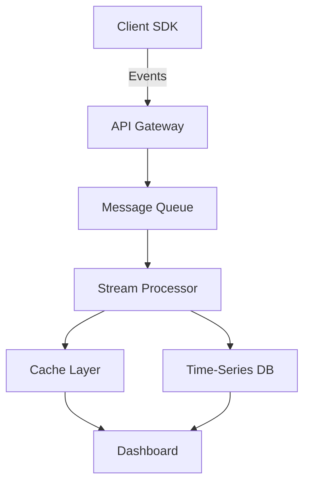

# Project Aurora

A next-generation real-time data processing pipeline built for scale.

## Overview

Project Aurora is designed to handle **10M+ events per second** with
sub-millisecond latency. It replaces the legacy batch processing system with a
modern streaming architecture.

> "The best way to predict the future is to build it." — Alan Kay

## Architecture



## Tech Stack

| Component        | Technology    | Purpose                   |
| ---------------- | ------------- | ------------------------- |
| API Gateway      | Rust + Actix  | High-throughput ingestion |
| Message Queue    | Apache Kafka  | Event streaming           |
| Stream Processor | Apache Flink  | Real-time analytics       |
| Time-Series DB   | ClickHouse    | Historical queries        |
| Cache Layer      | Redis Cluster | Low-latency reads         |
| Dashboard        | React + D3.js | Visualization             |

## Getting Started

### Prerequisites

- Docker 24.0+
- Rust 1.75+
- Node.js 20 LTS

### Quick Start

```bash
# Clone the repository
git clone https://github.com/example/aurora.git
cd aurora

# Start all services
docker compose up -d

# Run the development server
cargo run --release
```

### Configuration

```typescript
interface AuroraConfig {
  /** Maximum events per batch */
  batchSize: number;
  /** Flush interval in milliseconds */
  flushInterval: number;
  /** Compression algorithm */
  compression: "zstd" | "lz4" | "snappy";
  /** Retry policy */
  retry: {
    maxAttempts: number;
    backoffMs: number;
  };
}

const config: AuroraConfig = {
  batchSize: 10_000,
  flushInterval: 100,
  compression: "zstd",
  retry: {
    maxAttempts: 3,
    backoffMs: 1000,
  },
};
```

## Performance

Our benchmarks show significant improvements over the previous system:

$$
\text{Throughput} = \frac{\text{Events Processed}}{\text{Time (seconds)}} = \frac{10^7}{1} = 10\text{M events/s}
$$

The latency follows a log-normal distribution:

$$
P(x) = \frac{1}{x\sigma\sqrt{2\pi}} \exp\left(-\frac{(\ln x - \mu)^2}{2\sigma^2}\right)
$$

Where $\mu = 0.3\text{ms}$ (median latency) and $\sigma = 0.1$ (spread).

## Roadmap

### Phase 1 — Foundation (Q1 2026)

- [x] Core streaming engine
- [x] Kafka integration
- [x] Basic monitoring dashboard
- [x] Unit test coverage > 90%

### Phase 2 — Scale (Q2 2026)

- [x] Multi-region deployment
- [x] Auto-scaling policies
- [ ] Geographic routing
- [ ] Cost optimization

### Phase 3 — Intelligence (Q3 2026)

- [ ] Anomaly detection (ML pipeline)
- [ ] Predictive auto-scaling
- [ ] Natural language queries
- [ ] Custom alert rules

## API Reference

### Send Events

```python
import aurora

client = aurora.Client(api_key="ak_live_xxx")

# Send a single event
client.track("page_view", {
    "user_id": "u_12345",
    "page": "/dashboard",
    "duration_ms": 1250,
    "metadata": {
        "browser": "Chrome 120",
        "os": "macOS 14.3"
    }
})

# Batch send (recommended for high volume)
with client.batch() as batch:
    for event in events:
        batch.track(event.name, event.properties)
```

## Contributing

We welcome contributions! Please read our [Contributing Guide](CONTRIBUTING.md)
before submitting a pull request.

1. Fork the repository
2. Create your feature branch (`git checkout -b feature/amazing-feature`)
3. Commit your changes (`git commit -m 'Add amazing feature'`)
4. Push to the branch (`git push origin feature/amazing-feature`)
5. Open a Pull Request

---

_Built with love by the Aurora team. Licensed under MIT._
