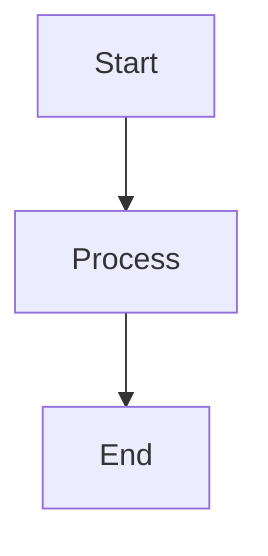
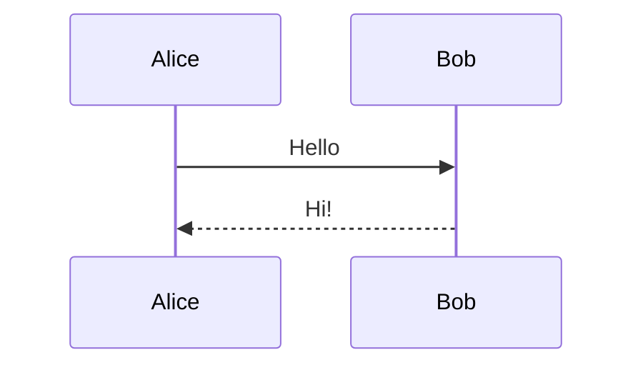

# Mermaid Error Handling Test

This file contains valid and invalid Mermaid diagrams for testing error
recovery.

## Valid Flowchart



## Invalid Syntax (should show error fallback)

```mermaid
this is not valid mermaid syntax !!!
invalid --> --> --> broken
```

## Valid Sequence Diagram


