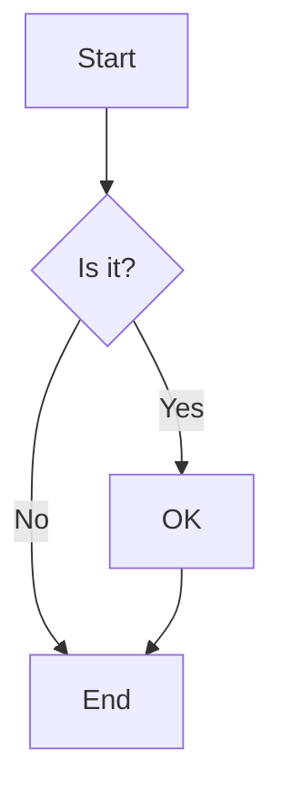
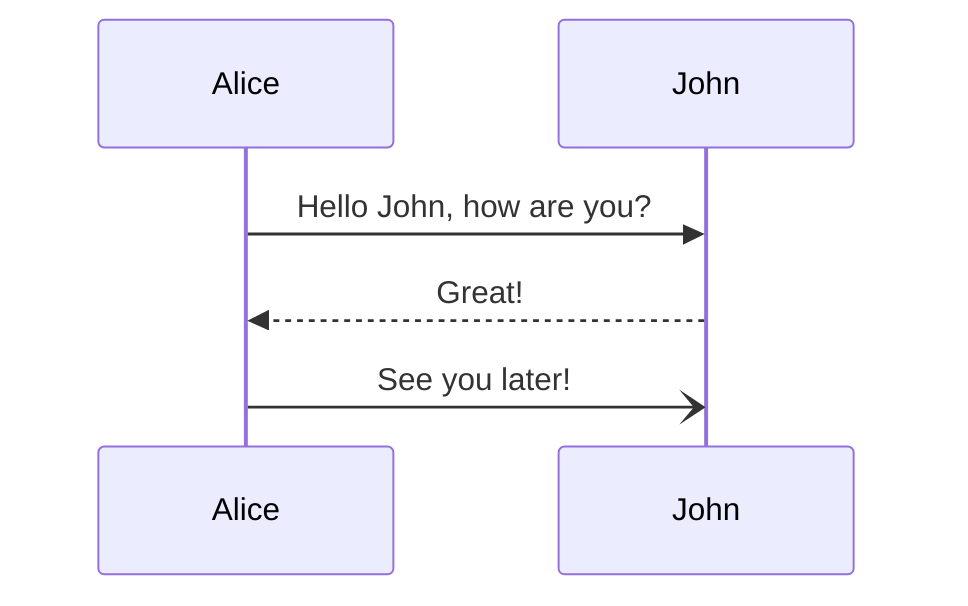
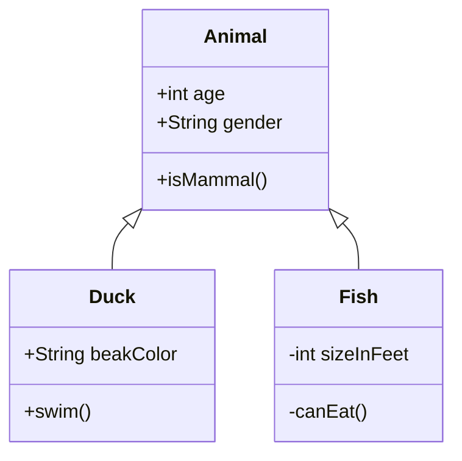
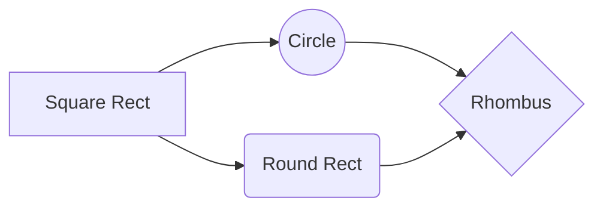

# Mermaid Diagram Test

This file contains various Mermaid diagrams for E2E testing.

## Flowchart

```mermaid
graph TD
    A[Start] --> B{Is it?}
    B -->|Yes| C[OK]
    B -->|No| D[End]
    C --> D
```

## Sequence Diagram

```mermaid
sequenceDiagram
    Alice->>John: Hello John, how are you?
    John-->>Alice: Great!
    Alice-)John: See you later!
```

## Class Diagram

```mermaid
classDiagram
    Animal <|-- Duck
    Animal <|-- Fish
    Animal: +int age
    Animal: +String gender
    Animal: +isMammal()
    class Duck{
      +String beakColor
      +swim()
    }
    class Fish{
      -int sizeInFeet
      -canEat()
    }
```

## Simple Graph

```mermaid
graph LR
    A[Square Rect] --> B((Circle))
    A --> C(Round Rect)
    B --> D{Rhombus}
    C --> D
```
