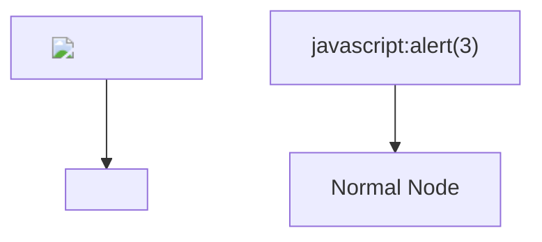
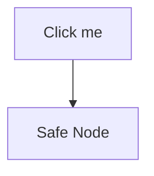
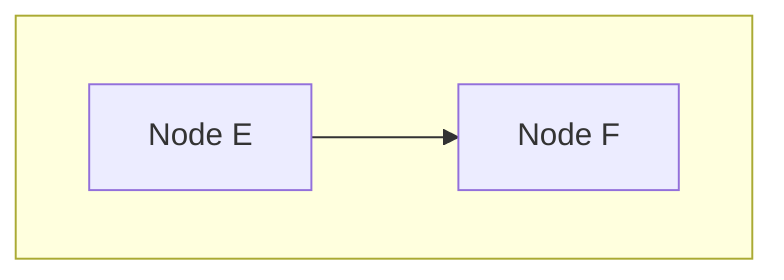

# Mermaid XSS Test

This document tests XSS attack vectors through Mermaid diagrams. All malicious
content should be neutralized by Mermaid's `securityLevel: 'strict'` setting.

## XSS via Node Labels

## XSS via Click Events

## XSS via Subgraph Title

